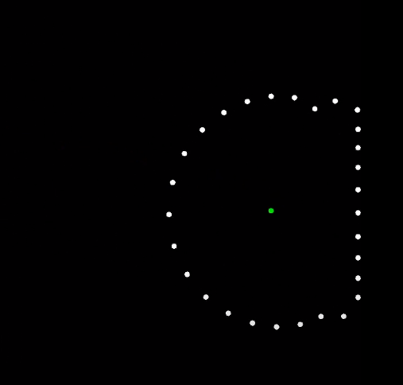

Physics Simulation
====================

Python physics simulation using Pyglet
---------------------

There are a lot of things here

## Issue tracking
- [x] Finish all planned simulations
- [x] README updated
- [ ] Review code and add comments

## Videos from my Youtube

## Picture from the bouncy ball simulation

